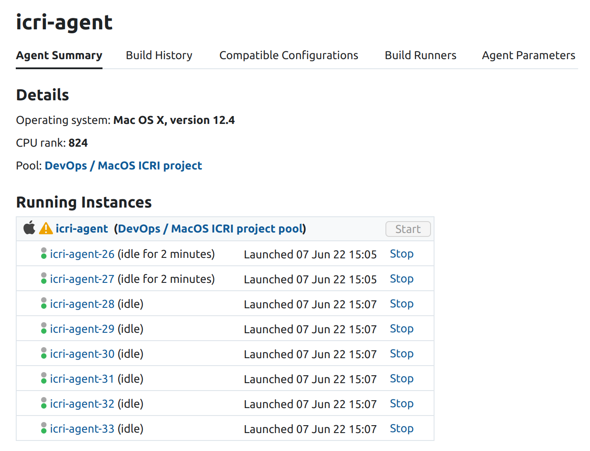
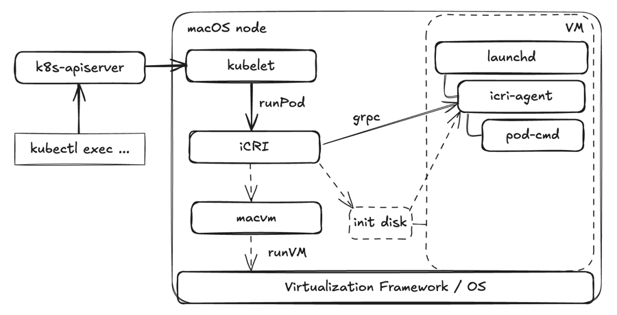
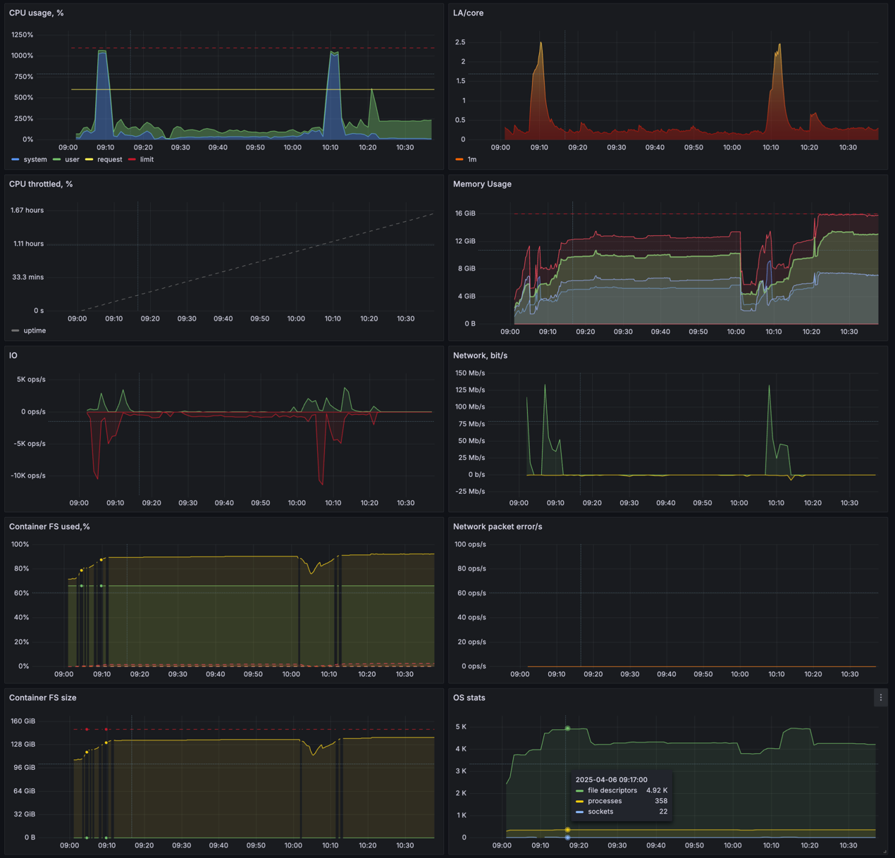
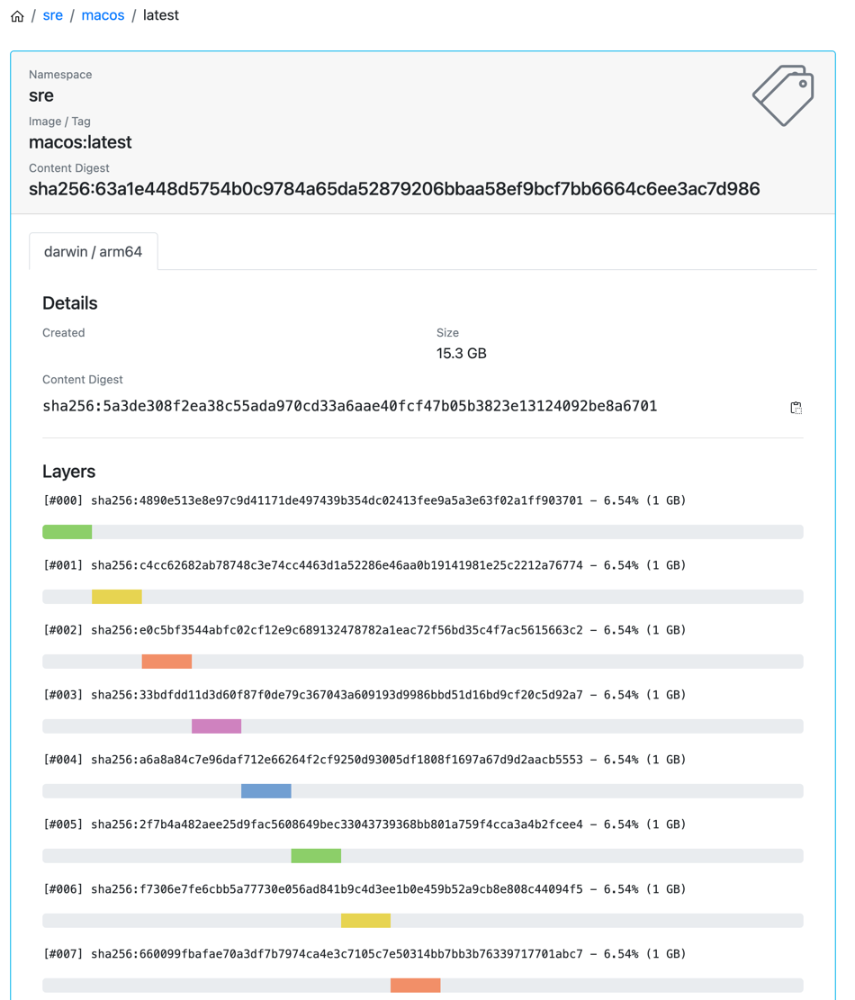
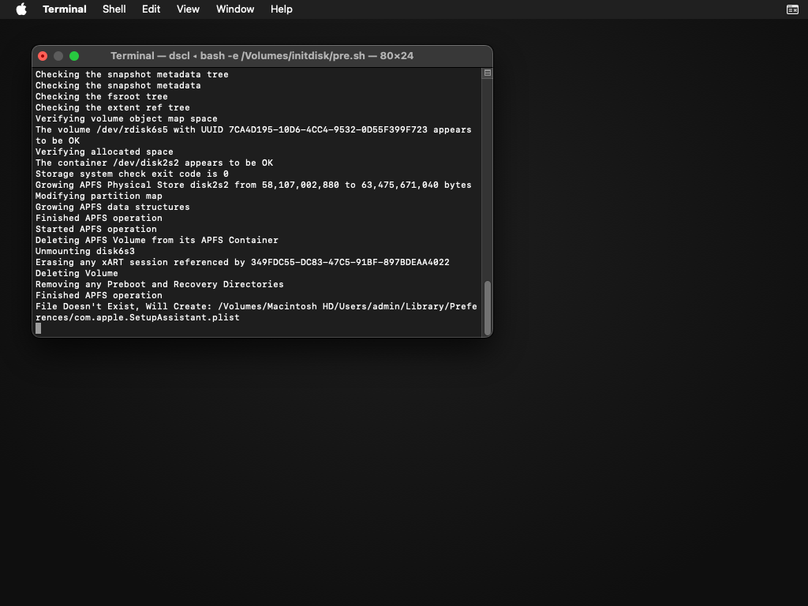

Today we are at **KubeCon 2024 Paris**, and I want to tell you the story behind this small glowing box:


<div style="clear: both"></div>

As it is now public at the JetBrains booth, many visitors ask questions. Yes, it's a Kubernetes Cluster with **Mac mini** nodes running macOS Pods. But let's start chronologically.

## Before WWDC 2022

Apple Silicon had been released a year earlier and was already a success. Every software company developing apps for macOS needed to test them on the new platform. But what options were available?

### Mac mini M1
That's how it usually begins. You can buy a Mac mini and install teamcity-agent there (or github-runner etc). That means builds will depend on the environment: installed software, system settings, OS version. Worse, you need to actively monitor the configuration of all the builds to have proper cleanups. Or leftovers from one build can affect the next. It is manageable on a small scale.
But we need to run thousands of completely different builds per hour with no delays and manage hundreds of such hosts. That doesn't scale well operationally and leads to delays and false-positive failures. Virtualization could help, so each build runs in a clean, disposable VM.

### VMWare vSphere
VMWare provides a virtualization solution for Intel-based Macs, which we've used for a long time with Mac Pro as a host. There are some complexities with replacing OSX with ESXi, and then creation of the VM image involves manual efforts. But at least VM were starting quickly and their performance was adequate. ESXi had no legal issues running the VMs since both the hardware and software were legally obtained from Apple, albeit it was never officially supported.
When [T2 security chip](https://en.wikipedia.org/wiki/Apple_T2) was introduced, stability declined. It sometimes took up to 9 restarts to boot a VM, startup time increased to a point where users just begin to keep their macOS agents running indefinitely. And no support from both Apple/VMWare was able to help in this case.
With macOS 13 and Apple Silicon, things with VMWare ESXi came to a complete halt, and VMWare vSphere [announced](https://kb.vmware.com/s/article/88698) the end of support for macOS virtualization for new generation of Mac.

### AWS
AWS also provides an option to run macOS in their cloud via [EC2 hardware instances](https://aws.amazon.com/ec2/instance-types/mac/).
On every restart these machines are completely wiped and re-created, which results in the waiting times of 2-3 hours, which does not play well with one-time build agents.
To reduce startup time, POC of a special image (AMI) was created with [Parallels](https://www.parallels.com/). It started VMs inside EC2 and provided some limited controls over it. But at least ephemeral VMs were starting quickly.
This, however, added a lot of management overhead with the need to orchestrate Parallels VM images between hosts, control access and licensing, etc.
The cost of this solution for a single month is equivalent to the price of a brand-new Mac mini.
Not to mention the mysterious performance issues with these EC2 Macs, found by performance tests.

## WWDC 2022
In June 2022 at [WWDC 2022](https://developer.apple.com/videos/play/wwdc2022/10002/) Apple released the [Virtualization Framework](https://developer.apple.com/documentation/virtualization), which allowed anyone to officially virtualize macOS 12 or later on Apple Silicon.
We've started our work with the early beta versions, and by the time the framework was released, we already had a working proof of concept: `macvm` binary written in Swift, which was able to create and run macOS VMs. The VM performance was near native, but before using it at a scale, we had to solve the following problems:
- How to distribute VM images between hosts?
- How to orchestrate VMs to hosts? Need to track available free and already full hosts
- How to teach TeamCity to create ephemeral VMs with agents in this "cloud"?

The last one in TeamCity terms sounds like developing a "cloud-profile" [plugin](https://github.com/JetBrains/teamcity-google-agent). We could even try to solve the second problem in the same code by writing a "scheduler"

But for SRE all those problems sound like "already solved in Kubernetes", where we also have a lot of experience. So, can we try to use k8s here too?
- Use [OCI registry](https://opencontainers.org/about/overview/) for VMs image distribution.
- Need to have `kubelet` running on macOS. There are no darwin binaries in Releases, but theoretically it is possible to compile go code for darwin.
- Then `kubelet` would communicate with some [CRI](https://kubernetes.io/blog/2016/12/container-runtime-interface-cri-in-kubernetes/) endpoint. It should be able to fetch images from the registry and unpack them (that is `containerd` in linux stack). We called our version `iCRI`.
- Then `iCRI` calls `macvm` binary we already have, to actually run VMs (same as `runc` is called to run containers on linux)

That was implemented, and the first Mac mini shelf became available to users in the same June 2022:
```bash
~ kubectl -n agents get pods
NAME            READY   STATUS    RESTARTS   AGE
icri-agent-26   1/1     Running   0          2m30s
icri-agent-27   1/1     Running   0          2m27s
icri-agent-28   1/1     Running   0          44s
icri-agent-29   1/1     Running   0          43s
icri-agent-30   1/1     Running   0          42s
icri-agent-31   1/1     Running   0          41s
icri-agent-32   1/1     Running   0          39s
icri-agent-33   1/1     Running   0          38s
```

{ width="100%" }
Now let's see how that shelf looked

## Hardware evolution
It is only legally permitted to run macOS on Mac hardware, and the same applies to virtualization. So we needed Mac minis and large numbers of them. As we are talking about datacenter installation, the minimal amount is a shelf in a rack. You need to take into account the "cold" and "warm" corridors, cable management, power requirements per rack, and compact packing to use fewer "units" in a rack.
Also, as these nodes are located in a remote datacenter, you want to have some remote management. So you could see the monitor when OS crashed and press keys or power button without visiting the datacenter.
Mac mini shelves evolution:





The first versions had different Mac arrangements to improve on cable management (=airflow), and different "servos" which were physically pressing the Power Button. Height was also reduced from 7U to 6U. They had 16 Mac minis, so it is 2.7 Macs per 1 Unit of Rack height.

And here is **v4**, which is 4x Mac minis in 1U. To make it possible, we have to strip the case (voiding warranty), and also control the Power Button directly from GPIO of Raspberry Pi KVM.


<div style="clear: both"></div>

During this time boards also progressed from M1 to M2 Pro 12cpu/32Gb/10Gbps.
The economics of this might be of interest to you. Apple Silicon was [such a hit](https://lemire.me/blog/2023/05/03/graviton-3-apple-m2-and-qualcomm-8cx-3rd-gen-a-url-parsing-benchmark/) that we can try to compare it even to a Linux ARM:
- `c7gn.2xlarge` 16.0GiB 8vCPUs is $411/mo - that is ~M1 but slower
- `c7g.4xlarge` 32.0GiB  16vCPUs is $452/mo - that is more like our M2 setup
- `mac2.metal` 16.0 GiB 12 vCPUs is $515/mo - but only M1 is available

To compare, let's calculate the price of 4 `mac2.metal` nodes for a year, it would be ~$24k. Our solution accounting for all the materials, human time, datacenter rent, and power costs is more than twice as cheaper. And that if nodes work for at least a year. But we still have our first M1 nodes running, and 2 years have passed already. That means it is economically viable to even run Linux ARM workloads on our Macs!

There are also some "untrusted" providers, which are not an option for us, but you might be interested:
- Hetzner [used to sell M1](https://www.hetzner.com/news/cyberdeals-2023/) at $58.31/mo, but not anymore
- [oakhost](https://www.oakhost.net/mac-mini-hosting) has M2 24Gb at $125/mo

That was a short part about HW, because [Ivan](https://x.com/Merocle) has more in-depth articles, I'm highly suggesting to read:
- [KVMac16](https://uplab.pro/2023/11/kvm-rack-stand-for-mac-minis-kvmac16/)
- [KVMac16 part2](https://uplab.pro/2023/12/kvm-rack-stand-for-mac-minis-kvmac16-part-2/)
 
And I would better describe the software part...

## Software evolution
We've started with a patch for kubernetes, to make `kubelet` and `kubeadm` working on darwin. For that you can get some inspiration in kubelet code for windows and start with an empty implementation of everything platform-specific.
As for VM images, everything would have to be baked into it. There were no `cloud-init` and `command`/`args` in `pod.spec` was ignored. That was not flexible, and the first thing to improve was to add a configuration agent into the VM.

### Agent
Usually you want to configure each new VM starting from the same golden image. For example, set a unique hostname or pass some token to the teamcity-agent, so it could register itself on a server.
But Virtualization Framework only allowed passing some ISO image from Host to VM for that. So, the first thing that comes to mind is to implement something like `cloud-init` inside a VM, which would read some config from a CD at VM boot time. But that also means, `cloud-init` binary should be baked into the VM image. And then how to update it in some old images? 
Also, what is it in the `pod.spec` which should be forwarded to the VM?
```yaml
apiVersion: v1
kind: Pod
metadata:
 name: test
spec:
 containers:
   - name: macos
     image: registry/macos:12.1
     command:
     - teamcity-agent
     env:
       - name: TC_CLOUD_PROFILE_ID
         value: kube-7
 enableServiceLinks: false
 runtimeClassName: macvm
 restartPolicy: Never
```
It is a `command` with `args` which should be started with `env`, and we should stream logs and exit-code back to CRI level. So, we end up placing `icri-agent` binary to ISO image at VM creation time. And only baking to the VM image a `launchd` unit for it. [This](https://excalidraw.com/#json=Ms1cHFKFKOVxhDB3j4Oq0,wNcYo7D6bG_lwEdZYmck0A) is how it works:


{ width="100%" }

That allowed developing and deploying new versions of `iCRI` (with embedded `icri-agent`) without affecting users changing their VM images. Even if an old image starts, it would run the latest `icri-agent` at boot time, and new features would be available there.
To support `kubectl exec` and `logs` grpc connection was added between `iCRI` and `icri-agent`. No ssh is needed on the VM side.

### Observability
There are no VM stats available in the Virtualization Framework, but we want to have metrics for our builds to investigate issues and better tune resources. At least something like `cadvisor` exposes for containers. The information can be obtained in two ways:
- Get it on the host level by measuring the system process `Virtual Machine Service` which corresponds to the running VM. That is more or less fine for total CPU/Memory usage. But cadvisor provides much more data, for example, counts of opened files, running processes, or used network sockets.
- Collect metrics inside each VM, treating OS metrics as a container one.

I've implemented the second option, adding export of cadvisor-like metrics to `icri-agent` above. For each metric in [the list](https://github.com/google/cadvisor/blob/master/docs/storage/prometheus.md#prometheus-container-metrics) I've found corresponding OS-level stat and a way to collect it. 
We use prometheus with a collection interval of 15s. And some OS stats could start to work very slowly when the VM is overloaded. For example, disk usage info is very slow when disk activity is high, so I've chosen to return the metrics which are ready before deadline (in 14s), instead of [waiting for everything](https://www.robustperception.io/remote-read-and-partial-failures/) and failing the whole scrape. That you can see on the graphs below, only disk stats are missing some points during the VM overload:


{ width="100%" }

As for the logs, we stream `stdout`/`stderr` from a VM to the CRI level on a host. And then it is collected by the usual k8s logs collector, so the logs have all the Pod labels and could be correlated with metrics. Also, k8s `events` are emitted as usual and collected to the same log system. So we can check the exit-code for a Pod which is long gone for `kubectl`.

Another part which is missing for a true "container-native observability" of macOS Pods was custom metrics. Users could expose own metrics on the Pod (VM) IP, but now Prometheus would reach them?

### Network
By default, VMs are running in an isolated host network and only NAT to outside is available. They are reachable from the host but cannot connect to each other (which is [configurable](https://developer.apple.com/documentation/vmnet/vmnet_enable_isolation_key)).
And that is usually enough to cover 90% of use cases. For the rest, Apple requires a Development Certificate and approving of [entitlements](https://developer.apple.com/documentation/bundleresources/entitlements/com.apple.vm.networking) for Bridge Networking:
> This entitlement is restricted to developers of virtualization software. To request this entitlement, contact your Apple representative.

After passing all this bureaucracy, you would be able to connect the VM interface to the host interface in bridge mode with its own MAC. Then you probably want to assign different IPs on the DHCP side (to make Pod IPs different from the Nodes IPs) or assign this interface to a separate VLAN.

Nobody of us wanted to waste time on non-technical "contacting Apple representative", so I've solved it by a "direct-routing [CNI](https://kubernetes.io/docs/concepts/cluster-administration/networking/#how-to-implement-the-kubernetes-network-model)":
- For it to work, both macOS and linux nodes of the k8s cluster should be in the same subnet
- You should configure different Pod subnet on each macOS node, here are the defaults:
  ```shell
  sudo defaults write /Library/Preferences/SystemConfiguration/com.apple.vmnet.plist Shared_Net_Address 192.168.64.1
  sudo defaults write /Library/Preferences/SystemConfiguration/com.apple.vmnet.plist Shared_Net_Mask 255.255.255.0
  ```
- On linux side you need to configure routes for each `mac-pod-subnet` pointing to `mac-node-ip`. As these subnets are external to cluster podNetwork, traffic to them is NATed to src `linux-node-ip`. This makes mac-pods reachable from linux-pods, and is enough to scrape Pods by Prometheus.
- If you want two-way connectivity, you need to actually use cluster podNetwork for `mac-pod-subnets`. And then configure reverse routes on macOS nodes side to `linux-pod-subnets` via `linux-node-ip`. You can make forward configuration done automatically if you set corresponding `spec.podCIDR` on k8s Node objects for macOS nodes (depends on CNI/IPAM). This way linux-pod to mac-pod works on direct routing. And mac-pod to linux-pod being SNATed to mac-node-ip. Which could be further solved by [pfctl](https://www.unix.com/man_page/osx/8/pfctl/) and disabling masquerading for the whole cluster podNetwork.

### Images
Apple VM works on a raw encrypted disk, and we've found no way to decrypt it or use it without encryption. That means its compression level is not so good, and you can't do FS layering. I.e., you could do a binary diff of a VM disk before xcode installation and after, and put this diff in an image layer. However, due to encryption even a small change, such as starting or stopping a VM, would result in a diff indicating that the entire disk has been modified. The usual VM image size with xcode installed is around 50Gb. That is compressed to around 30Gb. Then we split it to blobs of 1Gb and call them "layers" in the OCI image registry, just to have parallel push and pull in multiple streams.


{ width="100%" }

At the same time, APFS (macOS filesystem) has support for sparse files and copy-on-write files. The first one we use when attaching an additional empty disk to a VM. And the second is used to download an image once, and then start Pods from its clone while rejecting FS changes after Pod exited. That does not require 2x disk space.

Then we've also added custom Pod annotation to make it possible to push the image to the registry (if `command` exited with 0). Now users can start Pod on some `base` image, run installation scripts from configMap, and have the resulting image pushed as some new `xcode` image. That helped with automatic building and updating of user images. 
But what is the origin of this `base` image?

### Bootstrap
To create a VM image from scratch, you start with [ipsw restore](https://ipsw.me/) image. And then manually start this blank VM with GUI, configure some user for log in, add some tweaks here and there (some require entering into recovery mode), and finally configure launchd unit to start `icri-agent` from init-disk. Then push this image as a `base:ver` to the registry. That requires manual work and is fun only the first two times.
In the beautiful world full of unicorns shitting rainbows, we should have written a [packer](https://github.com/actions/runner-images/tree/main/images/macos/templates) plugin. But the chances it would be used outside are too bleak, so we end up writing a go binary. It consumes a config file with the list of keystrokes to send, how much to sleep, and commands to do a screenshot. The binary calls our `macvm` to start a VM with VNC enabled on hypervisor level, and then sends keystrokes, waits, and screenshots. These keystrokes, in turn, just open the terminal in recovery mode and start a provisioning script from an init-disk attached. That is how CI/CD for base images was made and still works.


{ width="100%" }

### VNC
It is also possible to connect via VNC to VM via `kubectl port-forward ... 5900`. Which is useful to debug some UI tests. For now, it works using VNC configured in the VM OS. 
Supporting VNC from the hypervisor level for Pods is a bit tricky. Because it means you should have the Pod `Running` while its `pod.spec.command` could be not even started and the VM is in recovery. Some huge leak of abstraction here.
But we also added another custom Pod level annotation to support the setting of [display resolution](https://en.wikipedia.org/wiki/Retina_display#Models).

### Host
We have applied a number of fixes at the host level to minimize its size and resource requirements. Ideally it should only run `kubelet` and use no additional resources. There is no way to disable UI, and there is no point in removing pre-installed software, as it is not stored on user rw data partition. But we are trying to disable everything not needed to be in a running state.
OS updates require reboot, so automatic updates are disabled, or it would break VMs running. Then updates are installed the same as on linux nodes, in batches with cordoning and awaiting Pods termination. It is handled by our configuration-management system, and that is not something [MDM](https://developer.apple.com/documentation/devicemanagement) could help with.

## KubeCon 2024 Paris
So that is the state for today. Unfortunately, it is not released as an open source. As we are a tiny team doing everything Infra, and had no free year of time to pass a KEP process in k8s. But it is not so important already, as many other tools for the same problem are released:
1. For `macvm` alternative there are multiple options:
- tart (has a forbidding [license](https://tart.run/licensing/))
- [macosvm](https://github.com/s-u/macosvm) was one of first `cli` to run VMs (Swift)
- Then go community started with [go binding](https://github.com/Code-Hex/vz) for Virtualization Framework, and based on it [vfkit](https://github.com/crc-org/vfkit) was created. That seems to be the most complete `cli` which we are also considering switching to. Lacks VNC and recovery mode.
2. For `iCRI` layer:
- https://github.com/agoda-com/macOS-vz-kubelet
3. For HW:
- GitHub runners: https://www.youtube.com/watch?v=I2J2MzKjcqY
- MacStadium Datacenter photos: https://www.macstadium.com/blog/m4-mac-mini-review
