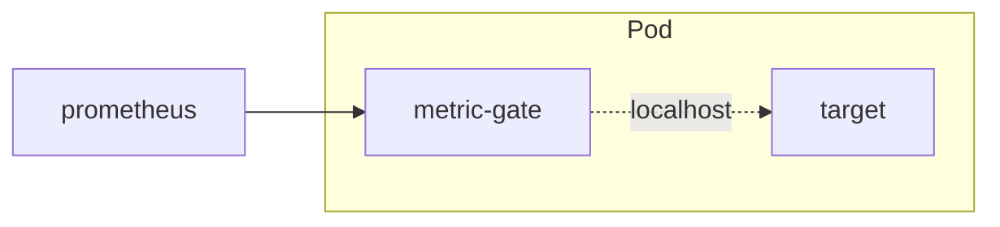
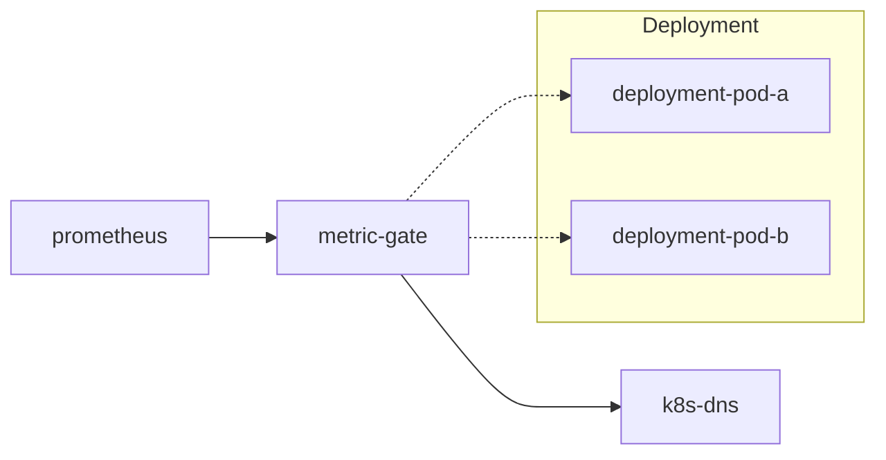
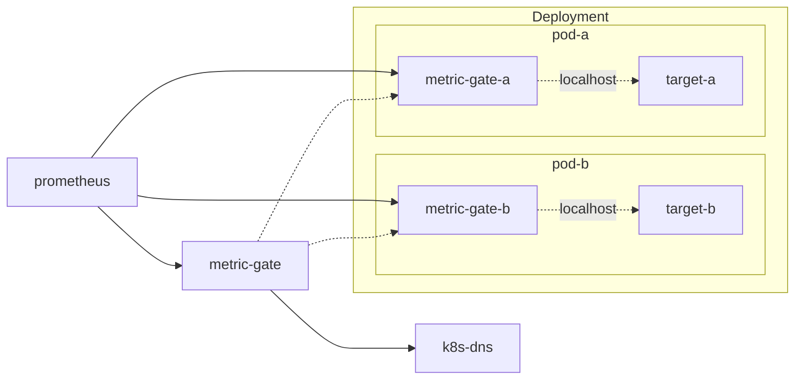

This is about a Prometheus scrape proxy that can filter and aggregate metrics at the source, reducing cardinality before the ingestion:


### Why?
There are cases when you do not need all the metrics exposed by a target. For example, k8s `ingress-nginx` exposes [6 Histograms](https://kubernetes.github.io/ingress-nginx/user-guide/monitoring/#request-metrics) (of 12 buckets each) for each Ingress object. Now suppose you have a k8s cluster with 1k Ingresses, each having 10 Paths defined:

[Cardinality](https://www.robustperception.io/cardinality-is-key/): 1000 ingresses * 6 histograms * 12 buckets * 10 paths = 720k metrics

The resulting size of the HTTP response on the `/metrics` endpoint is 276MB, which is pulled by Prometheus every `scrape_interval` (default 15s), leading to constant ~40Mbit/s traffic (compressed) on each replica Pod of ingress-nginx.

Sure, metrics could be filtered on the Prometheus side in `metric_relabel_configs`, but that will not reduce the amount of data being pulled from the target. And aggregation could then be done via `recording rules`, but you cannot drop already ingested source data afterward.

In our case, we do not need all the metrics, but ingress-nginx has no configuration option for that. So the idea is to add a proxy in between, which could filter some metrics or labels.

### Sidecar

We can add a sidecar container that connects to ingress-nginx via a fast `localhost` connection and then returns a smaller response to Prometheus (as shown in the picture above). Okay, but what would the configuration for that proxy look like?

As we need to be able to drop both metrics as a whole and individual labels, we need something flexible. I believe [metric_relabel_configs](https://prometheus.io/docs/prometheus/latest/configuration/configuration/#relabel_config) is a good fit.  
This way, we can reduce cardinality 10x by removing `path` label from the `ingress-nginx` metrics above:

```ini
# before
metric{ingress="test", path="/api", ...} 5
metric{ingress="test", path="/ui", ...} 2

# after
metric{ingress="test", ...} 7
```
That could be done by dropping the label from all metrics:
```yaml
metric_relabel_configs:
- action: labeldrop
  regex: path
```

So, it would work as `sum(metric) without(path)` in PromQL notation. That should do for Counters and Histograms but makes no sense for Gauges. In the case of ingress-nginx, that should be fine.

Also, we have multiple ingress-nginx replicas, which all serve the same 1k sites. But queries on the Prometheus side are mostly aggregations for a specific site, not for a specific replica. How can we reduce cardinality for replicas as well? 

### DNS mode

Let's take the idea from [Thanos](https://thanos.io/tip/components/query.md/), which has a DNS-resolving mode for endpoints. Prepending the URL with `dns+` leads to resolving the domain name into a list of IPs and then fanning out requests to all of them:


Because in k8s it is easy to have a [headless Service](https://kubernetes.io/docs/concepts/services-networking/service/#headless-services) for that usecase:
```yaml
apiVersion: v1
kind: Service
metadata:
  name: ingress-nginx-controller-metrics
spec:
  clusterIP: None # headless Service
  selector:
    app.kubernetes.io/name: ingress-nginx
  publishNotReadyAddresses: true # try to collect metrics from non-Ready Pods too
```
That should work but has some issues:

1. All the metrics are summed from all replicas, so information like `process_start_time_seconds`, which only makes sense for a single replica, becomes meaningless.
2. There is "automatic availability monitoring" based on the [up](https://prometheus.io/docs/concepts/jobs_instances/#automatically-generated-labels-and-time-series) metric in Prometheus, which can detect when a specific target is down. In this case, it would only provide the status of `metric-gate` itself, not each `ingress-nginx-controller` replica.
3. "Counter reset" detection would break in the case of aggregation. Consider this example:

|                     | t1  | t2         | t3  |
|---------------------| --- |------------| --- |
| `metric{instance="a"}` | 10  | 10         | 10  |
| `metric{instance="b"}` | 20  | 0          | 0   |
| `sum(rate(metric))` | 0   | 0          | 0   |
| `metric` aggregated | 30  | 10         | 10  |
| `rate(metric)`      | 0   | **10/15s** | 0   |

There are two pods (`a` and `b`) serving a `metric` counter. At point `t2`, we restart pod `b`. This works fine in Prometheus — see [Rate then sum](https://www.robustperception.io/rate-then-sum-never-sum-then-rate/) — because `rate()` is calculated first and detects the counter drop to 0, resulting in the correct `sum()` output.

Now, if we aggregate those two metrics into one (dropping the `instance` label), at point `t2` the value is 10. For `rate()`, that means a "counter reset" occurred (the counter value is less than before), so it reads as if the counter dropped to 0 and then increased to 10 within one scrape interval (15s), producing `rate=10/15s=0.67/s`, which is incorrect.
4. What should we do when we can't scrape one of the targets discovered via DNS? Returning partial data for the remaining targets would lead to spikes in graphs due to false counter resets. Maybe it is better to fail the whole scrape, so Prometheus graphs use neighboring points. But how many scrapes can we fail in a row?

There is no good solution for #3.  
For #4, we can add a configurable `timeout` for subrequests. Setting it higher than `scrape_interval` would cause a full scrape failure, while setting it lower would return partial data.  
And the first two could have the following solution:

### Subset mode

Taking our Ingress example again, [docs](https://kubernetes.github.io/ingress-nginx/user-guide/monitoring/#exposed-metrics) assign metrics to the following groups:

* `Request metrics`: the main number of series on each replica (~720k). We want to aggregate these across all replicas.
* `Nginx process metrics` and `Controller metrics`: 68 metrics in total. These only make sense for each specific replica.

To aggregate the first and directly scrape the second, we can stack `sidecar` and `dns` modes together:


For that to work, we need to split metrics from the target into multiple endpoints. Let's say the usual `/metrics` for process metrics and `/metrics/requests` for request metrics. Prometheus would scrape the `/metrics` endpoint with a small number of series, giving us per-replica data (and a working `up` metric). Meanwhile, `metric-gate` scrapes `/metrics/requests`, aggregates the large request data across all replicas, and only then returns it to Prometheus.

Those were my thoughts on how the problem could be approached. But maybe there is a solution already?

### Off-the-shelf

- [vmagent](https://docs.victoriametrics.com/victoriametrics/stream-aggregation/) can perform aggregation to new metric names and then send remote-write to Prometheus.  
  How to relabel metrics to the original form?  
  Possibly use `vmserver` instead of `vmagent`, to scrape `/federate` endpoint instead of remote-write, allowing relabeling in the scrape config on the Prometheus side
* [otelcol](https://github.com/open-telemetry/opentelemetry-collector-contrib/issues/4968#issuecomment-2148753123) could work, but needs relabeling on the Prometheus side to have metrics with original names.
* [Grafana Alloy](https://grafana.com/docs/alloy/latest/reference/components/otelcol/otelcol.processor.transform/) is similar to otelcol.
* [exporter_aggregator](https://github.com/tynany/exporter_aggregator) scrapes metrics from a list of Prometheus exporter endpoints and aggregates the values of any metrics with the same name and labels. Similar to `dns` mode, but with a static list of upstreams.
* [Telegraf](https://docs.influxdata.com/telegraf/v1/aggregator-plugins/merge/) and [Vector](https://vector.dev/docs/reference/configuration/transforms/aggregate/#aggregation-behavior) cannot aggregate metrics like `sum() without(label)` they only downsample values.

### Implementation

Okay, so "if you want a thing done well, do it yourself", or as others might call it, "NIH syndrome." Let's see what it should look like. That is basically an HTTP proxy, which does:

* Parse metrics from the target
* Relabel metrics
* Render the memory state to text metrics format

Prometheus packages are available for all three and could be reused. But all of the above is on the hot path. Because just getting 1.3M of metrics from `ingress-nginx` in a sidecar container takes ~4s:
```bash
$ k -n ingress-nginx exec -it ingress-nginx-controller-testing-7889b68f87-dz57l -- sh
/chroot/etc/nginx $ time wget localhost:10254/metrics -O - | wc -l
Connecting to localhost:10254 ([::1]:10254)
writing to stdout
-   100% |*******|  462M  0:00:00 ETA
written to stdout
real	0m 4.64s
user	0m 0.40s
sys	0m 1.10s
1293720
```
So we are left with 10s until the scrape timeout and nothing is done yet. Let's check where we can improve the speed. Relabel package implementation looks clean and simple. Render could be done via the `prometheus client` library, but it is too heavyweight. It also requires its own data structure and exports metrics with `# HELP` and `# TYPE` comments, which I would like to avoid to save bandwidth. It is easier to write a renderer from scratch. Parsing also looks unnecessarily complicated, so I did a go bench:
```
$ make bench
goos: darwin
goarch: arm64
pkg: github.com/sepich/metric-gate
BenchmarkParseLine0-16      232239      5100 ns/op      9184 B/op     110 allocs/op
BenchmarkParseLine1-16      983380      1246 ns/op      3120 B/op      11 allocs/op
BenchmarkParseLine-16      2222438       539.5 ns/op    1456 B/op       8 allocs/op
BenchmarkParseLine2-16     2635765       458.3 ns/op    1408 B/op       6 allocs/op
BenchmarkParseLine3-16     1817930       659.9 ns/op    1832 B/op      26 allocs/op
BenchmarkParseLine4-16     2623164       453.5 ns/op    1408 B/op       6 allocs/op
```
where:

* ParseLine0 uses Prometheus `expfmt.TextToMetricFamilies`
* ParseLine1 uses Prometheus `textparse.PromParser`
* ParseLine is the first attempt of a custom implementation
* ParseLine2 is an AI-improved version for speed (to the point of being unreadable)
* ParseLine3 attempt to use raw `[]byte` instead of `string` to skip UTF-8 decoding, but it turns out `Label` conversion to `string` is more expensive
* ParseLine4 attempt to use state-machine with only pointers to a slice (current version)

So, the custom implementation is >2x faster than using the Prometheus library. The actual algorithm matters less than the number of memory allocations per line.

If you've read this far, you are probably interested in the result. You can find it here:
https://github.com/sepich/metric-gate

or on Docker Hub:
```
$ docker run sepa/metric-gate -h
Usage of /metric-gate:
  -f, --file string               Analyze file for metrics and label cardinality and exit
      --log-level string          Log level (info, debug) (default "info")
  -p, --port int                  Port to serve aggregated metrics on (default 8080)
      --relabel string            Contents of yaml file with metric_relabel_configs
      --relabel-file string       Path to yaml file with metric_relabel_configs (mutually exclusive)
  -t, --scrape-timeout duration   Timeout for upstream requests (default 15s)
  -H, --upstream string           Source URL to get metrics from. The scheme may be prefixed with 'dns+' to resolve and aggregate multiple targets (default "http://localhost:10254/metrics")
  -v, --version                   Show version and exit
```
